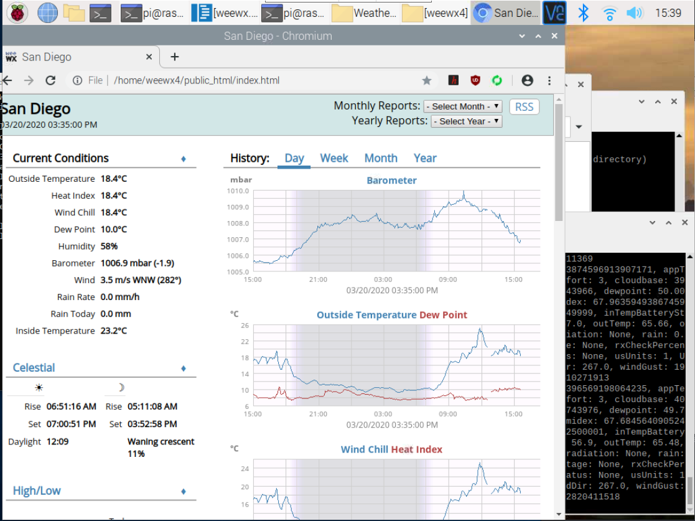
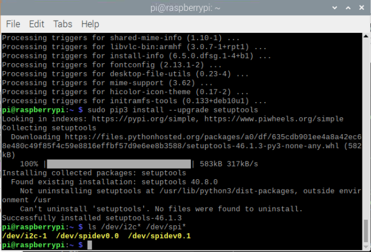
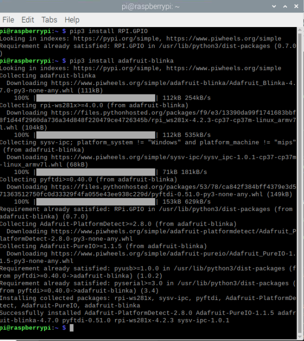
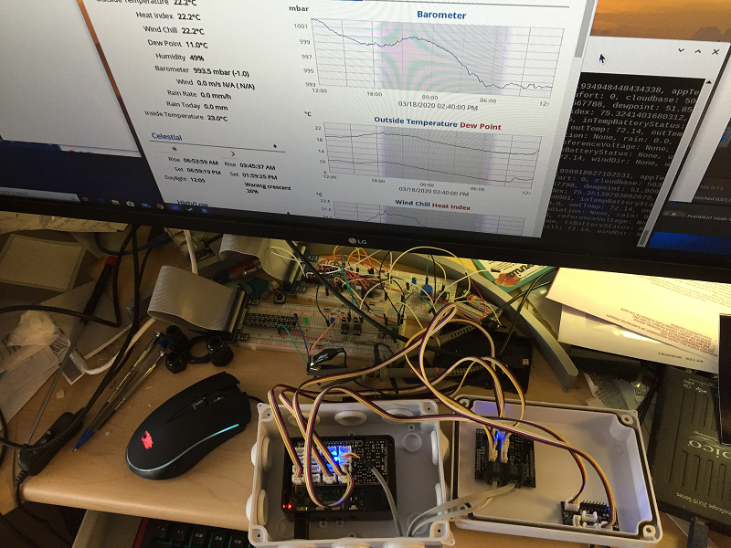
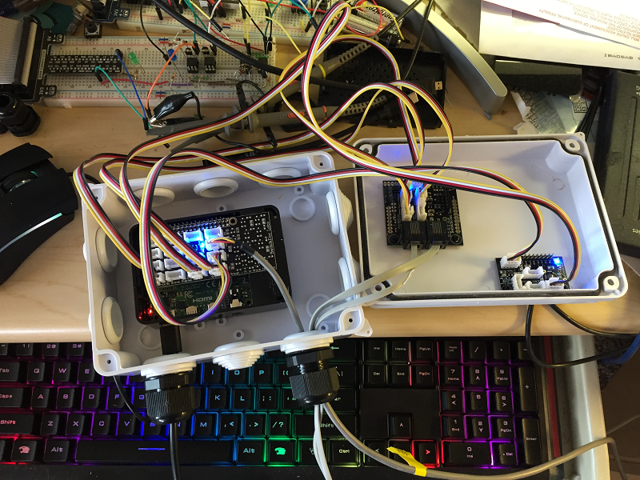
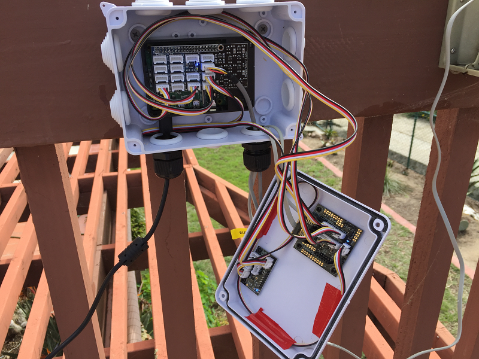
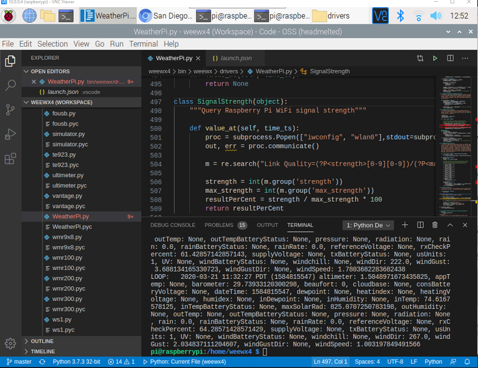
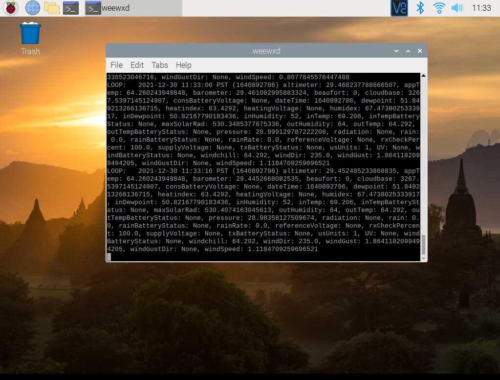

# WeatherPi
A Weewx 4.x python 3.x driver for using a Raspberry Pi 4B as a weather station.

This python driver is designed for use with the Weewx 4.0 weather station software.
As of this writing Weewx 4.x is still under development and can be found here:

http://weewx.com/downloads/development_versions/

Release versions are here:
http://weewx.com/downloads/

Currently this driver is known to work with Weewx 4.x versions:

Weewx version | Branch or Label | Notes
------------ | ------------- | -------------
4.0.0b14 | v4.0.0b16
4.0.0b16 | v4.0.0b16
4.0.0b17 | v4.0.0b17 | Some users may also require Weewx changset d077a8b
4.0.0b18 | v4.0.0b18         | Weewxb18 includes the above changset (d077a8b).
4.0.0    | V4.1.1            | First release of Weewx 4.x requires weewx.conf update (see example)
4.5.1    | v4.5.1            | Released version simple copy over to upgrade (updates databases to V4).

---
**NOTE**

Special thanks to the Weewx team for fast turn around time on an issue encountered by some users when attempting to use the new console logging mechanism. Details are on github. [issue 519](https://github.com/weewx/weewx/issues/519)

---



## Contents
- [Supported Hardware](#supported-hardware)
- [Installation](#installation)
- [Prerequisites](#prerequisites)
- [The Hardware](#the-hardware)
- [Compiling Weewx](#compiling-weewx)
- [Alternate Systemd Configuration](#alternate-systemd-configuration)

# Supported Hardware
The following list describes the hardware that this driver currently supports:

## Temperature Sensors
```
BMP280
AM2315
BSHT30A
FT020T  # switchdoc wireless weather station
F016TH  # switchdoc wireless Thermo-Hygrometer
```

## Humidity Sensors
```
BMP280
AM2315
BSHT30A
FT020T # switchdoc wireless weather station
F016TH # switchdoc wireless Thermo-Hygrometer
```

## Pressure Sensors
```
BMP280
```

## Anemometer
```
sen08942 # Sparkfun weather station
sen15901 # Sparkfun weather station
0015-WR-DSBT/SF # WeatherRack Weather SwitchDoc Labs
FT020T # switchdoc wireless weather station
```

## Wind Vanes
```
sen08942 # Sparkfun weather station
sen15901 # Sparkfun weather station
0015-WR-DSBT/SF # (WeatherRack Weather SwitchDoc Labs
FT020T # switchdoc wireless weather station
```

## Rain Guage
```
sen08942 # (Sparkfun weather station)
sen15901 # Sparkfun weather station)
0015-WR-DSBT/SF # WeatherRack Weather SwitchDoc Labs)
FT020T # switchdoc wireless weather station 
```

## Altimeter
```
BMP280
```

## WiFi Signal Strength
```
Raspberry Pi 3B
Raspberry Pi 4B

(just uses iwconfig so in theory any Pi model with WiFi should work.)
```

# Installation

If you have issues installing this driver via the weewx script it can alternatively be installed manually.  The process to install the driver manually is outlined below:

1) Copy the WeatherPi.py file to the weewx/bin/weewx/drivers/ folder

2) Modify the weewx/weewx.conf file to point the the WeartherPi.py driver:
    a) Change sation_type in the [Station] config section to station_type = WeatherPi
    b) Add a new [WeatherPi] config section to the conf file and fill it with default values.
```
        [WeatherPi]

          # The time (in seconds) between LOOP packets. Default is:
          loop_interval = 10

          # Debug level - the level of message logging. The higher
          # the number, the more info is logged.
          debug_read = 4

          # Used to calibrate the wind direction of the weather vane to
          # to real world coordinates in case it is off some.
          wind_direction_offset_angle = -93.0

          # The driver to use:
          driver = weewx.drivers.WeatherPi

          # Hardware  for your weather station
          observations = outTemp: AM2315, inTemp: BMP280, inHumidity: None, altimeter: BMP280, barometer: BMP280, windSpeed: SparkFun08942, windDir: SparkFun08942, windGust: SparkFun08942, outHumidity: AM2315, rain: SparkFun08942
```
          
3) Update the observations entry for weatherPi in the weewx.conf file.  This entry consists of a string containing the observation
that the software should monitor and poll.  Each entnty starts with the name of the weewx observation follwed by a colon followed
by the name of the hardware the WeeWX software should use for the polling operation.  Below is an example.  There are two ways to not monitor
observations, a) specify None for that observation type or b) do not include the observation type in the list.  By default an observation
not included uses None hardware driver for that observation. (Currently configobj and weewx only support a single line entry)

```
observations = outTemp: AM2315, inTemp: BMP280, inHumidity: None, altimeter: BMP280, barometer: BMP280, windSpeed: SparkFun08942, windDir: SparkFun08942, windGust: SparkFun08942, outHumidity: AM2315, rain: SparkFun08942
``` 

# Prerequisites

## Update your raspberry pi and python

```
sudo apt-get update

sudo apt-get upgrade

sudo pip3 install --upgrade setuptools

If above doesn't work try

sudo apt-get install python3-pip
```

## Enable I2C and SPI
The SPI bus can be enabled via the Raspberry Pi configuration under preferences from the Rasberry button on the desktop. Follow the instructions and reboot as required.
Once you're done with both and have rebooted, verify you have the I2C and SPI devices with the command:
```
Command:
ls /dev/i2c* /dev/spi*

Response:
/dev/i2c-1 /dev/spidev0.0 /dev/spidev0.1
```


## Install ADA Fruit Circuit Python libraries

This driver requires the ADA Fruit Circuit python libraries. It also requires the general purpose IO libray by Ben Croston.

Notes from ADA Fruit: The default python on your computer may not be python 3. Python 2 is officially discontinued and all our
libraries are Python 3 only. We'll be using python3 and pip3 in our commands, use those versions of python and pip to make sure
you're using 3 and not 2.

Weewx 4.x is Python 3 compatible

```
pip3 install RPI.GPIO
pip3 install adafruit-blinka
```



## Install hardware specfic libraries

```

pip3 install adafruit-circuitpython-sht31d
pip3 install adafruit-circuitpython-am2320
pip3 install adafruit-circuitpython-bmp280
pip3 install adafruit-circuitpython-ads1x15

```

# The Hardware







# Compiling Weewx

Compiling Weewx is very straightforwad with visual studio code which is free.  It is also lightweight enough to run happily directly on the Raspberry Pi. Steps are:

1) Download and install VS code for linux
2) Install the python add on extension
3) Open the code.
4) If you want to use integrated debugging you will need to create a custom .json file.  Here is an example:
```
{
    // Use IntelliSense to learn about possible attributes.
    // Hover to view descriptions of existing attributes.
    // For more information, visit: https://go.microsoft.com/fwlink/?linkid=830387
    "version": "0.2.0",
    "configurations": [       
    
        {
            "name": "Python: Current File",
            "type": "python",
            "request": "launch",
            "program": "${workspaceFolder}/bin/weewxd",
            "args": ["weewx.conf"],
            "console": "integratedTerminal"
        }
    ]
}
```


# Alternate Systemd Configuration
Below is an alternative systemd configuration for weewx.  I find it a little easier that using the default
daemon approach. This version will create a process that is visibly running weewx in a desktop terminal.

1) Create a config file for weewx for systemd

```
sudo nano /etc/systemd/system/weewx.service

```

2) Put the configuration required into the new file

```

[Unit]
Description=Start weewx
After=graphical.target
Requires=network.target

[Service]
Type=idle
User=pi
Environment=DISPLAY=:0
Environment=XAUTHORITY=/home/pi/.Xauthority
ExecStart=lxterminal -e "/usr/bin/python3 /home/weewx4/bin/weewxd"
Restart=always
RestartSec=120s
KillMode=process
WantedBy=graphical.target

[Install]
WantedBy=graphical.target

```

3) Save and close file (CTRL+O CTRL+X)

4) Change file permissions

```

sudo chmod 644 /etc/systemd/system/weewx.service

```
5) Update system control

```

sudo systemctl daemon-reload
sudo systemctl enable weewx.service

```

6) Reboot

At this point after reboot you should see weewx running on the desktop. And in thoery it will auto restsart
should any problems arise.




